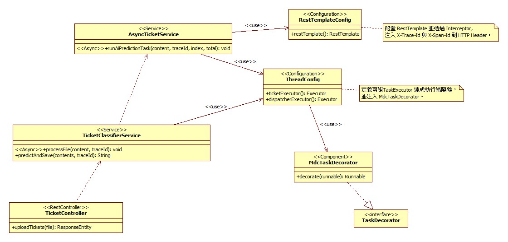

# AI-Ticket-Classifier: 高併發AI工單分類系統

本專案是一個從數據科學訓練模擬走向**工業級架構**的全棧系統。在 V1.1 版本中，解決了分散式系統中的**全鏈路日誌追蹤**、**非同步效能瓶頸**與**網路安全**。

---

## 系統架構設計

### 1. 流程時序圖


### 2. 結構類別圖



---

## 技術演進

### 防禦架構

- **內網隔離**：FastAPI 與 PostgreSQL 移除公網映射 (Port Mapping)，完全隱藏於 Docker 私有網路。
- **入口驗證**：Java Spring Boot 作為唯一 Gateway，強制執行 **JWT 身分驗證**。

### 非同步效能優化與壓測驗證

- **MDC 跨執行緒追蹤**：實作 `MdcTaskDecorator` 處理 `@Async` 執行緒切換導致的 TraceID 遺失問題，達成 **100% 全鏈路日誌追蹤**。
- **壓測數據證明**：
    - **情境**：模擬連續發送 5 批次（每批 1.6 萬筆，總計 8 萬筆資料）。
    - **表現**：系統全程無崩潰，**吞吐量達 206 筆/秒**。
    - **架構決策**：基於數據實測，目前的 `ThreadPoolExecutor` 已能覆蓋業務需求，故採簡約穩定的原生執行緒池設計。

### 即時反饋系統

- 整合 **WebSocket**，實作「請求立即響應、背景處理、結果主動推送」。

---

## 技術棧

| **領域** | **技術選型** | **系統應用** |
| --- | --- | --- |
| **AI / Serving** | Python, FastAPI, Scikit-learn | NLP 分類流水線 (TF-IDF + LR) |
| **Backend** | Java 17, Spring Boot 3.x | Spring Security, 多執行緒併發控制 |
| **Frontend** | Nuxt 4, Vue 3, EChart.js | 響應式儀表板、即時監控視窗 |
| **Infrastructure** | Docker, Docker Compose | 服務容器化、私有網絡隔離 |

---

## 快速啟動

### 前置需求

- **Docker & Docker Compose**
- **WSL2** (Windows 環境)

### 啟動步驟

```bash
# 1. Clone the repository
git clone https://github.com/NickHsieh0926/ai-ticket-classification.git

# 2. Start the services (Production Mode)
# 此模式下 FastAPI (8000) 與 DB (5432) 不會對外開放
docker-compose up --build -d
```

> 若需於本地使用 GUI 工具 (如 DBeaver、pgAdmin) 連接資料庫，請於 `docker-compose.yml` 中開啟 `postgres` 服務的 `ports` 註解。
>