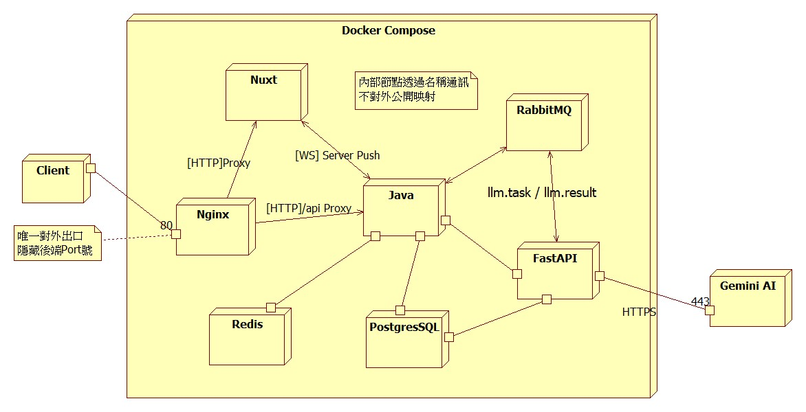
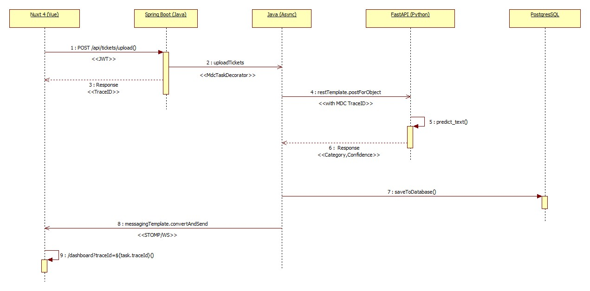
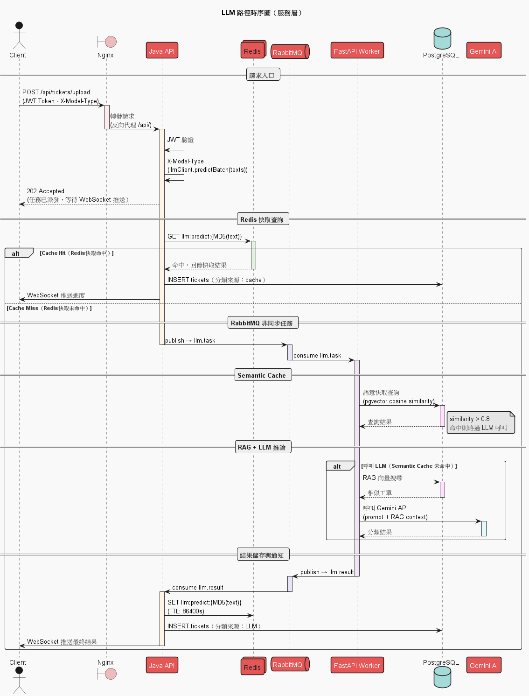
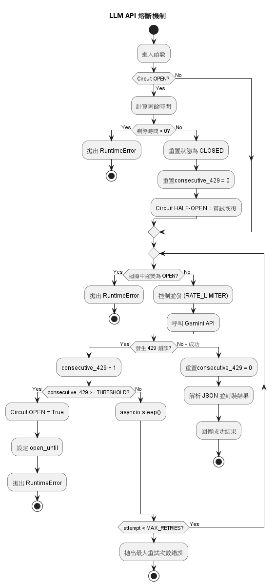

# AI Ticket Classification

企業 IT 工單自動分類系統。

**V1.1.0** 以 TF-IDF + Logistic Regression 實現純 ML 分類，壓測 8 萬筆工單吞吐量達 **206 筆/秒**，但對語意模糊工單力不從心，且單體架構難以擴展。

**V2.0.0** 在保留 ML 高吞吐路徑的前提下，透過 SOLID 重構解耦架構，並新增 LLM（Gemini）+ RAG 推論路徑、Redis 精確快取、pgvector Semantic Cache、RabbitMQ 非同步佇列，以及 ML vs LLM A/B 比較儀表板，解決語意分類、Token 成本與慢速阻塞三大瓶頸。

---

## 技術棧

| 層級 | 技術 | 版本 |
|------|------|------|
| API Gateway / 靜態服務 | Nginx | alpine |
| Backend API | Spring Boot WebMVC | 4.0.1 |
| AI 推論 / RAG | FastAPI | 0.115.x |
| ML 模型 | scikit-learn TF-IDF + LR | .joblib |
| LLM | Google Gemini API | gemini-2.5-flash-lite |
| Embedding | sentence-transformers | - |
| 向量 DB | pgvector（PostgreSQL 擴充） | pg16 |
| 精確快取（MD5 exact match）| Redis | 7.x |
| Semantic Cache（cosine > 0.95）| pgvector（PostgreSQL）| pg16 |
| 訊息佇列 | RabbitMQ | 3.x |
| 關聯式 DB | PostgreSQL | 16 |
| Frontend | Nuxt 4 / Vue 3（Static SPA） | - |
| Java | Java | 17 |
| Python | Python | 3.11 |
| 容器化 | Docker / Docker Compose | - |
| 安全 | Spring Security + JWT | jjwt 0.11.5 |

---

## 系統架構圖

### 元件圖（Component Diagram）

> 系統由 Nginx、Nuxt、Java、Redis、RabbitMQ、FastAPI 所組成



---

### ML 上傳路徑（Sequence Diagram）

> ML 路徑非同步高併發完整流程



---

### LLM 上傳路徑（Sequence Diagram）

> LLM 路徑：Redis 快取、RabbitMQ 非同步、Semantic Cache、RAG 推論完整流程



---

### Gemini API 熔斷機制（Activity Diagram）

> 429 限速時的三態熔斷邏輯：CLOSED → OPEN → HALF-OPEN



---

## V1.1.0 → V2.0.0 升級說明

V1.1.0 以 TF-IDF + Logistic Regression 實現高吞吐 ML 分類（206 筆/秒，8 萬筆壓測通過），
但面臨以下瓶頸，驅動 V2.0.0 的全面升級：

---

### 瓶頸一：ML 模型對語意模糊工單力不從心 → 引入 LLM + SOLID 重構

**V1.1.0 的問題：**
TF-IDF 依賴關鍵字頻率，遇到「這個月費用感覺有點奇怪」這類語意曖昧的工單，分類準確率明顯下降。
同時原先 `TicketClassifierService` 將 CSV 解析、AI 推論、進度推播耦合在單一類別，
無法在不更動 ML 程式碼的情況下新增 LLM 路徑。

**V2.0.0 的做法：**
先以 SOLID 原則重構 Java 後端，拆分為獨立介面與實作：

| 職責 | 介面 | 可替換實作 |
|------|------|----------|
| AI 推論 | `IAiInferenceClient` | `MlRestApiClient` ↔ `LlmApiClient` |
| 業務協調 | `ITicketAppService` | `TicketAppServiceImpl` |

重構後新增 LLM（Gemini）路徑。兩條路徑平行存在，以 `X-Model-Type` header 切換。

---

### 瓶頸二：LLM 推論秒級延遲，批次上傳同步等待體驗差 → RabbitMQ 非同步解耦

**V1.1.0 的問題：**
ML 推論毫秒級，可同步等待。但 Gemini API 單次回應需數秒，
50 筆工單若同步呼叫 LLM 則使用者需等待數分鐘，HTTP 執行緒長時間阻塞。

**V2.0.0 的做法：**
```
Java 收到上傳請求 → 立即回傳 traceId（不等 LLM）
  ↓
工單任務送進 RabbitMQ llm.task queue
  ↓
FastAPI Consumer 背景消費 → Gemini 推論
  ↓
結果送回 llm.result queue → Java → WebSocket 即時推播進度
```

LLM 的慢速完全被非同步架構吸收，Consumer 推論失敗時仍回傳 `status: error` 結果，確保進度條推進至 COMPLETED，不永久卡死。

---

### 瓶頸三：相同工單重複呼叫 Gemini API，Token 成本持續累積 → 雙層快取

**V1.1.0 的問題：**
企業 IT 工單高度重複（「忘記密碼」「帳單異常」以不同措辭反覆出現），
V1.1.0 的 ML 路徑不需考慮此問題，但 LLM 會依 Token 計費，重複呼叫直接燒配額。

**V2.0.0 的做法：兩層快取各司其職**

| 層級 | 技術 | 攔截情境 | 節省效果 |
|------|------|---------|---------|
| 精確快取 | Redis（MD5 key）| 文字完全相同 | 零 Token，毫秒回應 |
| Semantic Cache | pgvector（cosine > 0.95）| 語意相近、措辭不同 | 零 Token，毫秒回應 |

「I can't login」與「Unable to sign in」精確快取無法命中，但 Semantic Cache cosine 相似度 > 0.95 直接攔截，不打 Gemini API。

---

### 瓶頸四：LLM 缺乏領域背景，邊界工單分類不穩定 → RAG 增強推論

**V1.1.0 的問題：**
ML 靠訓練資料決策，LLM 靠通用語言模型，兩者對「系統反應慢是 Technical 還是 General？」這類邊界工單都容易分類失準，且 LLM 無法說明理由。

**V2.0.0 的做法：**
```
新工單 Embedding → pgvector 檢索 Top-3 語意最相似歷史工單（含已知分類）
  → 組裝 few-shot prompt → Gemini API
```

LLM 拿到具體的企業案例作為參考，回傳結果附帶 `reasoning` 欄位說明分類依據，準確率與可解釋性同步提升。

---

### 瓶頸五：無法量化評估 LLM 是否真的比 ML 更準 → A/B 比較儀表板

**V1.1.0 的問題：**
導入 LLM 後缺乏客觀比較基準，無法回答「LLM 改善了多少？哪些工單類型兩者結果不同？」

**V2.0.0 的做法：**
同一份 CSV 同時觸發 ML 與 LLM 兩條路徑（共用 `traceId`），
兩條路徑皆完成後才推送 `COMPLETED`，前端逐筆對比分類結果，統計整體一致率，量化兩種模型的差異。

---

### 瓶頸六：Gemini API 速率限制（429）導致批次分類中斷 → 固定重試 + 熔斷機制

**V2.0.0 的問題：**
批次工單透過 MQ Consumer 密集呼叫 Gemini API，高峰期超過 RPM 配額，API 回傳 `429 Too Many Requests`。
`prefetch_count=5` 下五個 coroutine **各自獨立**等待重試，互不感知，導致超過 10 筆時每筆等待長達 20 秒。

**V2.0.0 的做法：兩層防禦機制**

| 層級 | 機制 | 作用 |
|------|------|------|
| 第一層 | 固定 1 秒重試間隔（最多 3 次）| 單筆 429 暫時性失敗，等待後重試 |
| 第二層 | 共享熔斷器（Circuit Breaker）| 連續 3 次 429 後開啟熔斷，所有任務立即快速失敗 |

```
正常狀態（CLOSED）
  → 遇到 429 → 固定等待 1 秒 → 重試
  → 連續 3 次 429 → Circuit OPEN（冷卻 30 秒）
  → OPEN 期間所有新任務立即快速失敗（不打 API）
  → 30 秒後進入 HALF-OPEN → 試探一次
  → 成功 → 回到 CLOSED；失敗 → 重新 OPEN
```

**與單純重試的差異：**

| | 單純指數退避重試 | 固定重試 + 熔斷（本方案）|
|--|----------------|----------------------|
| 每筆最差等待 | 2+4+8 = 14 秒 | 1+1 = 2 秒 |
| 多任務感知 | ❌ 各自獨立 | ✅ 共享熔斷狀態 |
| 持續 429 時 | 每筆繼續等待重試 | 立即快速失敗，不消耗等待時間 |

---

## 快速啟動

### 前置需求

- Docker Desktop（含 Docker Compose）

### 步驟

```bash
# 1. Clone
git clone https://github.com/NickHsieh0926/ai-ticket-classification.git
cd ai-ticket-classification

# 2. 設定環境變數
cp docker/.env.example docker/.env
# 編輯 docker/.env，填入實際金鑰與密碼

# 3. 啟動所有服務
cd docker
docker-compose up -d --build

# 4. 開啟瀏覽器
http://localhost
```

### 預設帳號

| 帳號 | 密碼 |
|------|------|
| admin | 123456 |

---

## 環境變數

複製 `docker/.env.example` 為 `docker/.env`，填入以下設定：

```bash
# 資料庫
DB_HOST=postgres
DB_PORT=5432
DB_NAME=ai_ticket
DB_USERNAME=sa
DB_PASSWORD=your_db_password

# JWT
JWT_SECRET=your_jwt_secret

# LLM API 金鑰（目前使用 Gemini）
GEMINI_API_KEY=your_gemini_key

# Redis
REDIS_HOST=redis
REDIS_PORT=6379
REDIS_PASSWORD=your_redis_password

# RabbitMQ
RABBITMQ_HOST=rabbitmq
RABBITMQ_USER=guest
RABBITMQ_PASSWORD=your_mq_password
```

---

## 服務端口

| 服務 | 對外端口 | 用途 |
|------|---------|------|
| Nginx | 80 | 前端 SPA + API 反向代理（主入口） |
| RabbitMQ Management | 15672 | MQ 管理介面 |
| Redis Insight | 5540 | Redis GUI |
| PostgreSQL | 5432 | 開發測試用（正式環境建議關閉） |

---

## 管理介面（對外，開發用）

```bash
# docker-compose.yml
# 新增rabbitmq 管理介面
  rabbitmq:
    ports:
      - "15672:15672"
       
# 新增Redis Insight 管理介面
  redis-insight:
    image: redis/redisinsight:latest
    ports:
      - "5540:5540"
    depends_on:
      - redis
    networks:
      - app-network
```

```bash
# 1. RabbitMQ Management
<http://localhost:15672/>
Username: ${RABBITMQ_USER}
Password: ${RABBITMQ_PASSWORD}

# 2. Redis Insight
<http://localhost:5540/>
# 點擊 "Add Redis database"，請依照以下資訊填寫：
Host: redis ( service 名稱 )
Port: 6379
Database Alias:（Local-Redis）
Password: ${REDIS_PASSWORD}
```

---

## 專案結構

```
ai-ticket-classification/
├── llm/                        ← Python 服務（FastAPI + ML + LLM + RAG）
│   ├── api/main.py             ← FastAPI 入口，含 MQ Consumer 啟動
│   ├── src/                    ← ML 推論、LLM 推論、前處理
│   ├── rag/                    ← Embedder、Retriever、Semantic Cache
│   ├── worker/mq_consumer.py   ← RabbitMQ Consumer
│   └── models/                 ← 訓練好的 .joblib 模型
│
├── java/                       ← Spring Boot 服務
│   └── wp/ai-ticket/src/main/java/com/hcy/ai_ticket/
│       ├── web/controller/     ← REST API、JWT 攔截器
│       ├── service/
│       │   ├── ticketclassifier/
│       │   │   ├── impl/ml/    ← ML 推論客戶端、非同步執行緒服務
│       │   │   ├── impl/llm/   ← LLM 客戶端、批次派發、Redis 快取
│       │   │   └── impl/ab/    ← AB 進度追蹤器
│       │   ├── mq/             ← RabbitMQ Producer / Consumer
│       │   └── webSocket/      ← WebSocket 進度推播
│       └── util/
│           └── CacheKeyUtils   ← 統一 MD5 cache key 產生（含文字正規化）
│
├── frontend/                   ← Nuxt 4 SPA
│   └── app/
│       ├── pages/              ← login、upload、tickets、Dashboard、ab-comparison
│       ├── composables/        ← useTicketSocket（WebSocket 管理）
│       ├── stores/             ← Pinia：auth、task、tickets、model
│       └── types/              ← TypeScript 型別定義
│
├── docker/
│   ├── docker-compose.yml      ← 完整環境（nginx、java、fastapi、postgres、redis、rabbitmq）
│   ├── nginx/nginx.conf        ← 反向代理設定
│   └── .env.example            ← 環境變數範本
│
└── DB/
    └── init.sql                ← 建表、pgvector、semantic_cache、ab_comparison view
```

---

## API 端點

### Java Spring Boot（經由 Nginx `/api/`）

| Method | URL | 說明 |
|--------|-----|------|
| POST | `/auth/login` | JWT 登入 |
| POST | `/api/tickets/predict` | 單筆推論（Header `X-Model-Type: ml\|llm`） |
| POST | `/api/tickets/predict/batch` | 多筆推論（Body `{"texts":[...]}` + Header `X-Model-Type: ml\|llm`） |
| POST | `/api/tickets/upload` | CSV 批次上傳（ML 或 LLM） |
| POST | `/api/tickets/upload/ab` | CSV 批次上傳（同時執行 ML + LLM） |
| GET | `/api/tickets/trace-ids` | 所有歷史批次 traceId |
| GET | `/api/tickets/ab-trace-ids` | 僅含 AB 批次的 traceId |
| GET | `/api/tickets/stats?traceId=` | 統計儀表板資料 |
| GET | `/api/tickets/ab-comparison?traceId=` | ML vs LLM 比較資料 |
| WS | `/ws/progress` | 批次進度即時推播 |

### FastAPI（內部，不對外）

| Method | URL | 說明 |
|--------|-----|------|
| POST | `/predict` | 單筆 ML 推論 |
| POST | `/predict_batch` | 批次 ML 推論 |
| POST | `/llm_predict` | LLM + RAG 推論 |

---

## 壓測紀錄

| 情境 | 結果 |
|------|------|
| 5 批次 × 16,000 筆（共 80,000 筆） | 全程無崩潰，吞吐量 **206 筆/秒** |

---